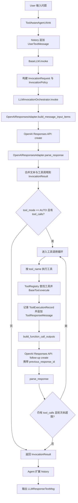
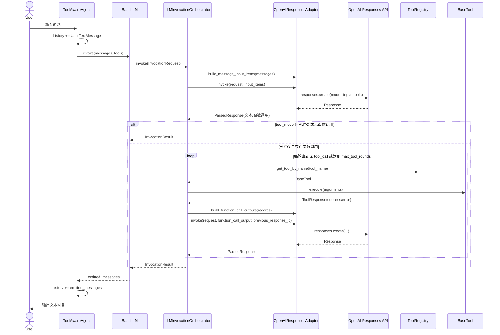

# OpenAI 工具调用中间层实现总结

## 1. 目标与边界

本次实现聚焦在 LLM 层的可维护性和强类型设计，目标是：

- 仅支持 OpenAI Responses API 标准。
- 支持工具调用的三种策略：off / manual / auto。
- 通过强类型模型收敛参数与响应格式，减少弱类型字典流转。
- 将协议细节与业务回合解耦，避免 BaseLLM 持续膨胀。

不在本次范围内：

- 流式工具调用编排（当前仍保留原始流式文本能力）。
- 并行工具执行与复杂调度策略。

## 2. 分层架构

### 2.1 Facade 层

- BaseLLM 对外保留 invoke 与 invoke_streaming。
- invoke 已切换到强类型中间层调用。
- invoke_streaming 继续走原逻辑，保证兼容与渐进迁移。

### 2.2 Adapter 层

- OpenAIResponsesAdapter 负责：
  - Message -> OpenAI input items 的映射。
  - Tool 描述 -> OpenAI tools payload 的映射。
  - Response -> ParsedResponse 的解析。
  - ToolExecutionRecord -> function_call_output 的回灌构建。

### 2.3 Middleware 层

- LLMInvocationOrchestrator 负责状态机编排：
  - 首轮模型调用。
  - 工具调用解析。
  - 工具执行与错误归一。
  - function_call_output 回灌与后续轮次调用。
  - 最大工具轮次终止与重试控制。

### 2.4 Agent 层

- ToolAwareAgent 负责：
  - 用户输入入历史。
  - 通过 BaseLLM + ToolRegistry 执行一次完整回合。
  - 将回合输出写回历史并打印文本回复。

## 3. 强类型设计清单

### 3.1 调用契约模型

在 llm_types.py 中新增并落地：

- ToolCallMode
- RetryPolicy
- InvocationPolicy
- InvocationRequest
- ParsedTextChunk
- ParsedToolCall
- ParsedResponse
- ToolExecutionRecord
- OpenAIInputItem
- OpenAIToolSpec
- InvocationResult

### 3.2 消息模型

在 message.py 中强化：

- Message 使用 default_factory 修复时间戳默认值问题。
- LLMResponseFunCallMsg 补齐 tool_name、call_id、arguments_json、arguments。
- ToolResponseMessage 引入 tool_name、call_id、status。
- 通过 classmethod 工厂构建复杂消息，避免子类初始化弱类型问题。

## 4. 状态机流程

中间层核心流程如下：

1. PREPARE: 构建请求、策略、工具映射。
2. CALL_MODEL: 执行首轮模型调用（带重试）。
3. PARSE_OUTPUT: 提取文本与 function_call。
4. EXECUTE_TOOLS: 当 mode=auto 时执行工具并记录结果。
5. APPEND_TOOL_OUTPUT: 将 function_call_output 回灌到下一轮。
6. LOOP_OR_DONE: 判断是否继续，或触发 max_tool_rounds_reached。

## 5. 功能概述（用于 Review）

当前功能能力：

- 支持 off / manual / auto 三种工具策略。
- 支持多轮工具调用闭环（受 max_tool_rounds 控制）。
- 支持模型调用重试（attempt + backoff）。
- 工具执行结果统一收敛为 ToolExecutionRecord。
- 返回统一 InvocationResult，包含：
  - emitted_messages
  - response_ids
  - tool_execution_records
  - total_tool_rounds
  - stopped_reason

## 6. 主要变更文件

- frame/core/llm_types.py
- frame/core/message.py
- frame/core/openai_adapter.py
- frame/core/llm_orchestrator.py
- frame/core/base_llm.py
- frame/agents/tool_aware_agent.py
- frame/tool/register.py
- frame/test/test_message.py
- frame/test/test_llm_invoke.py

## 7. 验证结果

已执行测试命令：

- /root/agent/.venv/bin/python -m pytest frame/test -q

结果：4 passed。

覆盖重点：

- 消息模型工厂方法。
- orchestrator 在 auto/manual 下的分支行为。

## 8. 已知限制与后续建议

### 8.1 已知限制

- orchestrator 目前不支持 stream=True。
- 工具执行为串行，未开启并行。
- 响应解析主要聚焦 output_text 与 function_call 两类。

### 8.2 后续建议

- 将流式事件并入同一中间层语义，统一同步/流式行为。
- 增加工具并行执行策略与冲突控制。
- 对 adapter 添加更细粒度协议单元测试（异常字段、边界 payload）。
- 在 ToolAwareAgent 中补充多轮交互策略（例如显式结束判断、可配置输出策略）。

## 9.现有设计流程图与时序图示例

